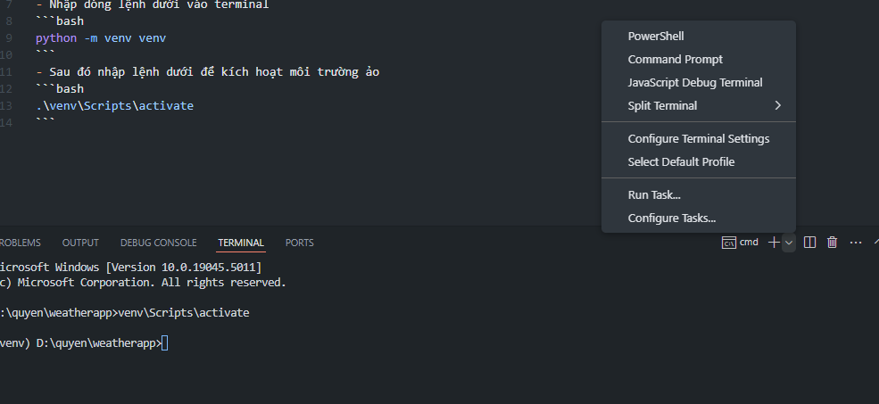

# Cách làm

## PHần này là trước khi cho chạy code (Có nghĩa là mình đang setup)

### 1. Tạo môi trường ảo
- Mở terminal (nhớ chuyển qua CMD, nhìn ở góc trên bên phải). Nhìn hình minh họa

- Nhập dòng lệnh dưới vào terminal
```bash
python -m venv venv
```
- Sau đó nhập lệnh dưới để kích hoạt môi trường ảo
```bash
venv\Scripts\activate
```
- Sau đó cài dặt các thư viện cần thiết trong requirements.txt bằng lệnh dưới
```bash
pip install -r requirements.txt
```


### 2. Sau setup, chạy code

### Kích hoạt môi trường ảo
- Bật terminal (Nhớ chuyển qua cmd)
```bash
venv\Scripts\activate
```

- Sau đó chạy file main.py
```bash
python main.py
```